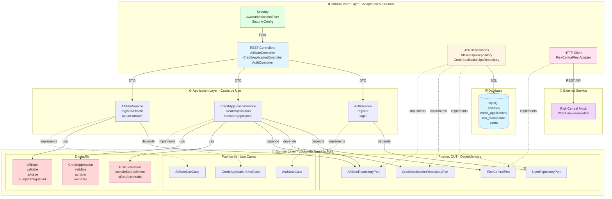
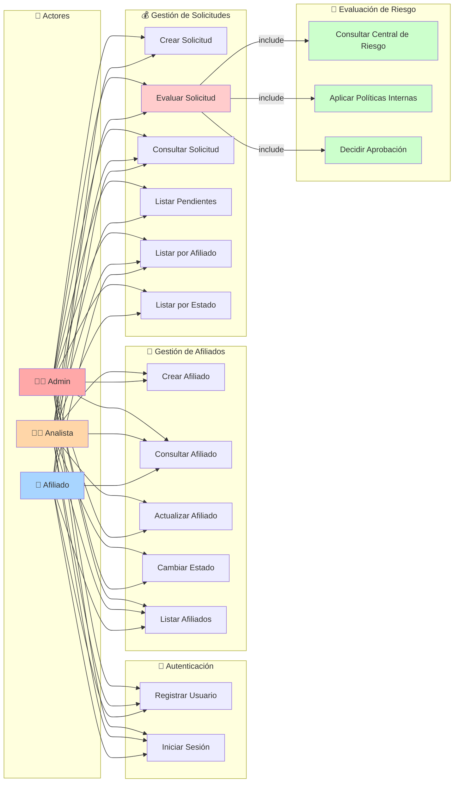
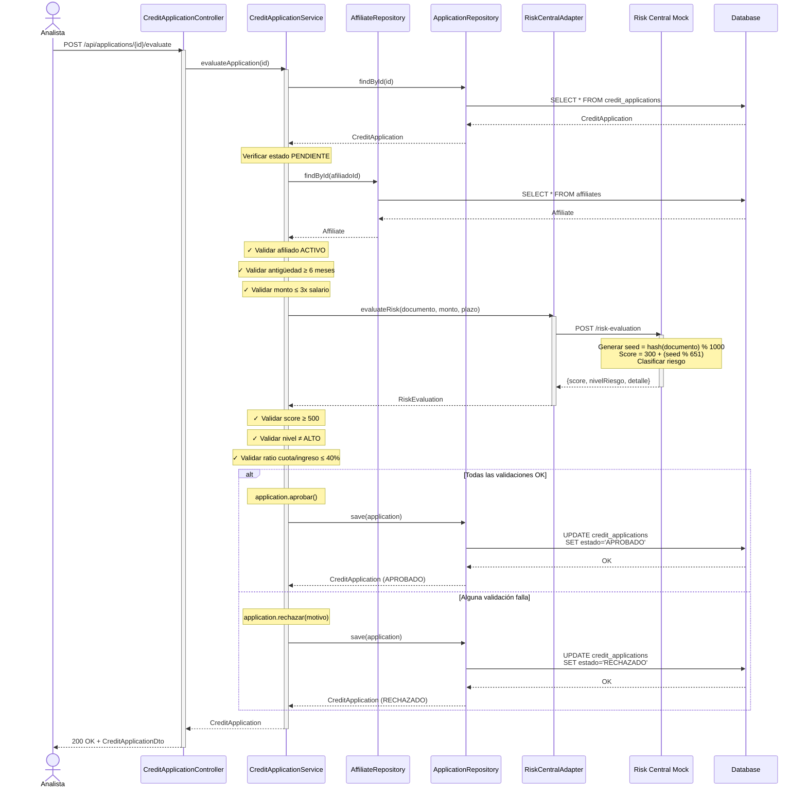
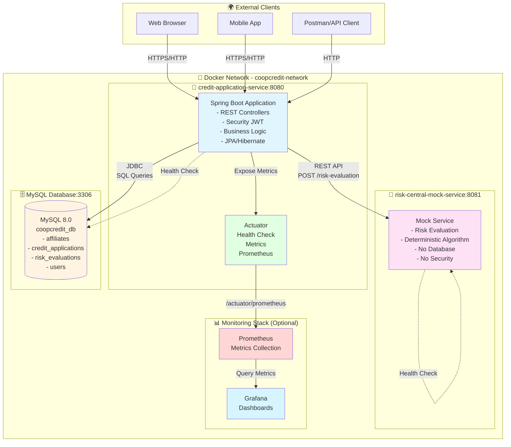
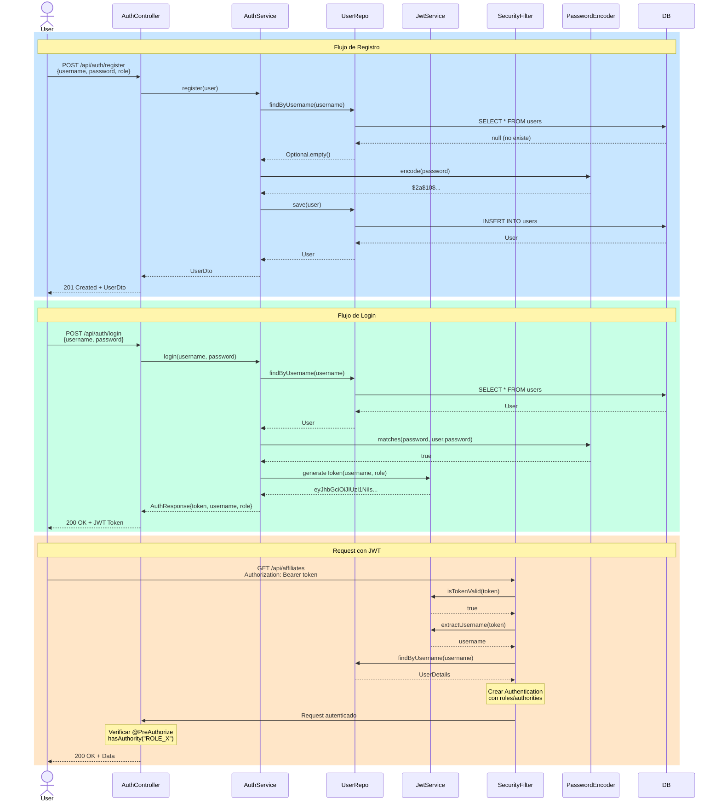
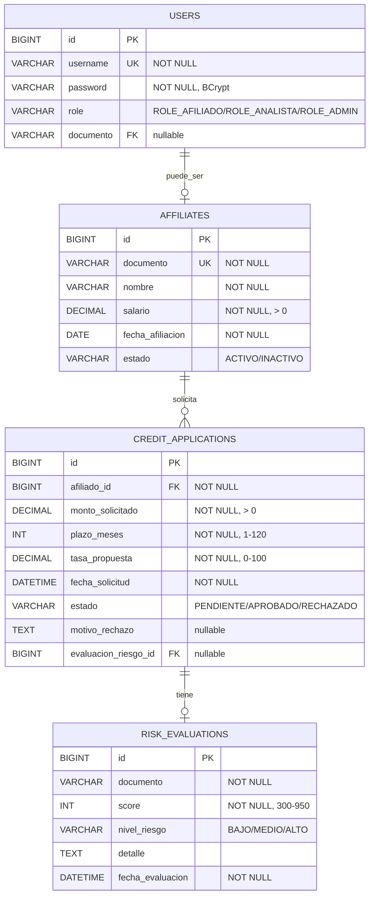
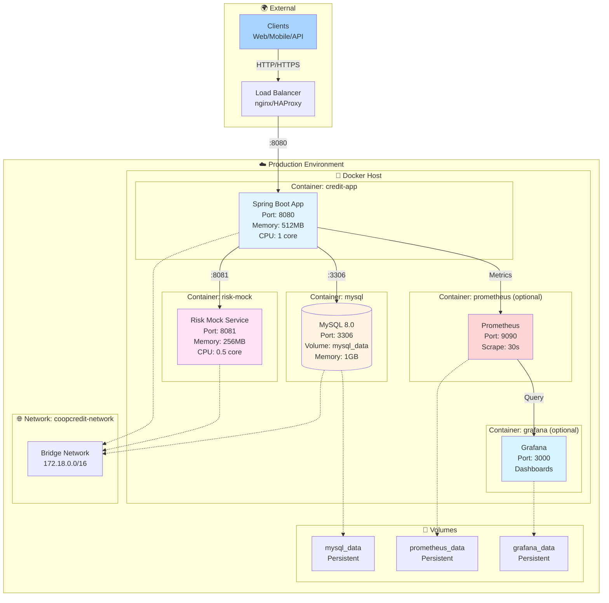

# 📊 Diagramas del Sistema CoopCredit

Este documento contiene todos los diagramas arquitectónicos y de diseño del sistema CoopCredit en formato Mermaid.

---

## 🏗️ 1. Arquitectura Hexagonal



---

## 🎯 2. Diagrama de Casos de Uso



---

## 🔄 3. Diagrama de Secuencia - Evaluación de Solicitud



---

## 🌐 4. Arquitectura de Microservicios



---

## 🔐 5. Diagrama de Autenticación y Autorización



---

## 📊 6. Modelo de Datos (ER Diagram)



---

## 🔄 7. Flujo Completo de Evaluación de Crédito

```mermaid
flowchart TD
    START([👤 Afiliado solicita crédito]) --> CREATE[Crear Solicitud<br/>Estado: PENDIENTE]
    CREATE --> WAIT[⏳ Esperar Evaluación]
    
    WAIT --> ANALYST[👨‍💼 Analista inicia evaluación]
    
    ANALYST --> CHECK1{¿Afiliado ACTIVO?}
    CHECK1 -->|NO| REJECT1[❌ RECHAZAR<br/>Motivo: Afiliado inactivo]
    CHECK1 -->|SÍ| CHECK2{¿Antigüedad ≥ 6 meses?}
    
    CHECK2 -->|NO| REJECT2[❌ RECHAZAR<br/>Motivo: Antigüedad insuficiente]
    CHECK2 -->|SÍ| CHECK3{¿Monto ≤ 3x salario?}
    
    CHECK3 -->|NO| REJECT3[❌ RECHAZAR<br/>Motivo: Monto excede máximo]
    CHECK3 -->|SÍ| CALL_RISK[🌐 Consultar Central de Riesgo]
    
    CALL_RISK --> RISK_CALC[📊 Calcular Score<br/>seed = hash(doc) % 1000<br/>score = 300 + seed % 651]
    
    RISK_CALC --> CLASSIFY{Clasificar Riesgo}
    CLASSIFY -->|300-500| HIGH[🔴 ALTO]
    CLASSIFY -->|501-700| MEDIUM[🟡 MEDIO]
    CLASSIFY -->|701-950| LOW[🟢 BAJO]
    
    HIGH --> CHECK4
    MEDIUM --> CHECK4
    LOW --> CHECK4
    
    CHECK4{¿Score ≥ 500?} -->|NO| REJECT4[❌ RECHAZAR<br/>Motivo: Score bajo]
    CHECK4 -->|SÍ| CHECK5{¿Nivel ≠ ALTO?}
    
    CHECK5 -->|NO| REJECT5[❌ RECHAZAR<br/>Motivo: Riesgo alto]
    CHECK5 -->|SÍ| CALC_RATIO[📈 Calcular Ratio Cuota/Ingreso]
    
    CALC_RATIO --> CHECK6{¿Ratio ≤ 40%?}
    CHECK6 -->|NO| REJECT6[❌ RECHAZAR<br/>Motivo: Ratio excede máximo]
    CHECK6 -->|SÍ| APPROVE[✅ APROBAR]
    
    REJECT1 --> SAVE_REJECT[💾 Guardar en BD]
    REJECT2 --> SAVE_REJECT
    REJECT3 --> SAVE_REJECT
    REJECT4 --> SAVE_REJECT
    REJECT5 --> SAVE_REJECT
    REJECT6 --> SAVE_REJECT
    
    APPROVE --> SAVE_APPROVE[💾 Guardar en BD]
    
    SAVE_REJECT --> NOTIFY_REJECT[📧 Notificar Rechazo]
    SAVE_APPROVE --> NOTIFY_APPROVE[📧 Notificar Aprobación]
    
    NOTIFY_REJECT --> END([🏁 FIN])
    NOTIFY_APPROVE --> END

    style START fill:#a8d5ff
    style APPROVE fill:#a8ffa8
    style REJECT1 fill:#ffa8a8
    style REJECT2 fill:#ffa8a8
    style REJECT3 fill:#ffa8a8
    style REJECT4 fill:#ffa8a8
    style REJECT5 fill:#ffa8a8
    style REJECT6 fill:#ffa8a8
    style CALL_RISK fill:#ffffa8
    style END fill:#d5a8ff
```

---

## 🔧 8. Diagrama de Deployment



---

## 📝 Notas sobre los Diagramas

### Cómo visualizar
Estos diagramas están en formato Mermaid y se pueden visualizar en:
- GitHub (automático)
- GitLab (automático)
- VS Code (extensión Mermaid Preview)
- [Mermaid Live Editor](https://mermaid.live/)

### Convenciones
- 🔵 **Azul**: Capa de infraestructura / Adaptadores de entrada
- 🟡 **Amarillo**: Capa de aplicación / Casos de uso
- 🔴 **Rojo**: Capa de dominio / Lógica de negocio
- 🟢 **Verde**: Servicios externos / Base de datos
- 🟣 **Morado**: Servicios mock / Utilidades

### Arquitectura Destacada
1. **Hexagonal**: Dominio completamente independiente
2. **Puertos y Adaptadores**: Interfaces bien definidas
3. **Microservicios**: Separación clara de responsabilidades
4. **Seguridad**: JWT con roles granulares
5. **Observabilidad**: Actuator + Prometheus + Grafana
